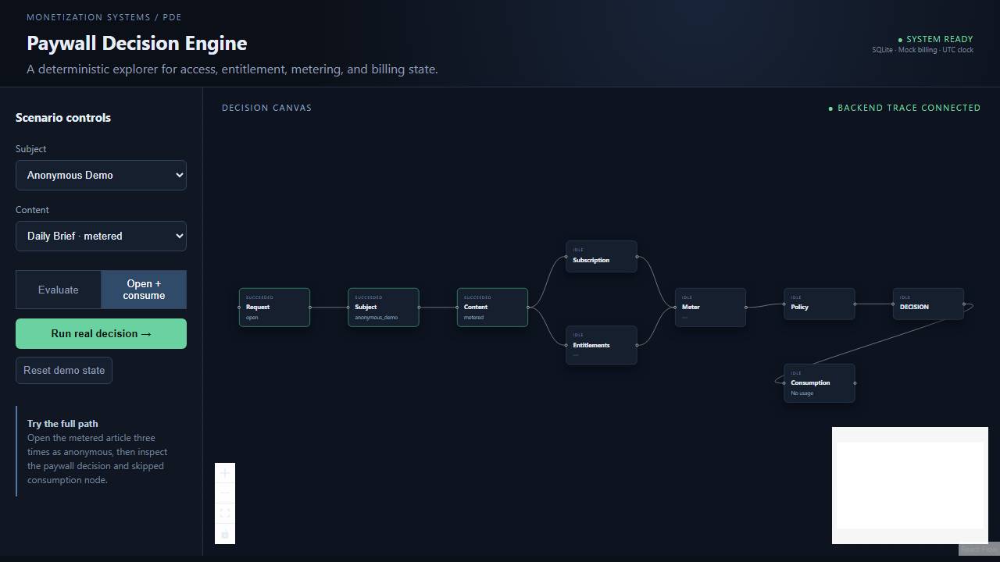

# Paywall Decision Engine

An executable reference implementation for subscription access, entitlements, metered usage, billing projection, and traceable paywall decisions.

The project is deliberately local-first and Docker-free: Python/FastAPI, normalized SQLite persistence, deterministic seed data, a mock HMAC billing provider, and a React + XYFlow visual explorer. It does not implement checkout, cards, authentication, or a provider-time authorization dependency.

## Capabilities

| Concern | Implementation |
|---|---|
| Access classification | public, metered, premium, unpublished |
| Entitlements | explicit plan catalog and effective subscription resolver |
| Metering | UTC calendar-month windows; anonymous 3, registered 5 |
| Consistency | evaluate is read-only; open rechecks and consumes once |
| Idempotency | subject + operation + key fingerprint; conflicts return 409 |
| Billing | normalized mock events, HMAC verification, duplicate/stale handling |
| Auditability | persisted-shaped decision and ordered trace response |
| UI | real backend-powered decision canvas, inspector, state summary |
| Evaluation | exactly 12 deterministic scenarios |

## Run locally

```powershell
cd backend
python -m venv .venv
.\.venv\Scripts\Activate.ps1
pip install -e ".[dev]"
alembic upgrade head
python -m app.seed
uvicorn app.main:app --reload
```

In another terminal:

```powershell
cd frontend
npm install
npm run dev
```

Open http://localhost:5173. The API is http://localhost:8000.

## Real UI capture

The following image is a browser capture of the running React/XYFlow explorer.



## Deterministic evaluation

```powershell
cd backend
python -m app.evaluation.run
pytest
ruff check .
```

The UI calls the same API engine. Select a subject/content pair, choose Evaluate or Open + consume, and inspect the actual policy path. Reusing an open key returns the prior result without another meter increment.

## Architecture

```text
React Explorer -> FastAPI -> Access Service -> Ordered Policies
                                      |             |
                                      v             v
                          Subscription Projection  Trace
                                      ^
                         Signed Mock Billing Events
```

Billing provider state is normalized into an internal subscription projection. That projection, not a billing API call, is the decision-time source of truth. `past_due` keeps qualifying entitlements for a three-day grace period; cancel-at-period-end keeps access until the effective period boundary; trials expire at their exact end timestamp.

See [docs/architecture.md](docs/architecture.md), [docs/decision-lifecycle.md](docs/decision-lifecycle.md), [docs/entitlement-model.md](docs/entitlement-model.md), [docs/billing-events.md](docs/billing-events.md), and [docs/visual-flow.md](docs/visual-flow.md).

The complete card-by-card delivery map is in [docs/roadmap.md](docs/roadmap.md).

## Roadmap

### Delivered

- PDE-001–PDE-010: repository, domain catalog, subscription semantics, entitlements, monthly meter, open idempotency, and normalized SQLite tables
- PDE-011–PDE-019: ordered policies, engine, API, traces, signed mock billing, stale/duplicate handling, and 12-scenario evaluation
- PDE-020–PDE-025: interactive XYFlow explorer, backend trace mapping, inspector, replay-ready execution model
- PDE-026–PDE-027: quality gates, documentation, and portfolio polish

### Production evolution (intentionally not implemented)

- SQLite/local state → PostgreSQL and an atomic high-contention meter strategy
- Mock provider → Stripe/Adyen/Paddle adapters
- local traces → OpenTelemetry and an analytics store
- demo device identity → privacy-reviewed identity strategy

## Trade-offs

This is a decision architecture demonstration, not a billing platform. The mock provider is educational, the projection can be temporarily behind an external provider, and SQLite cannot claim globally distributed concurrency guarantees. No secrets are sent to the frontend.

## License

MIT
